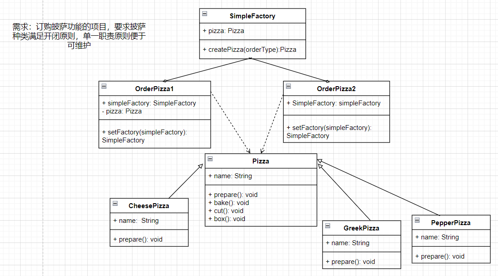
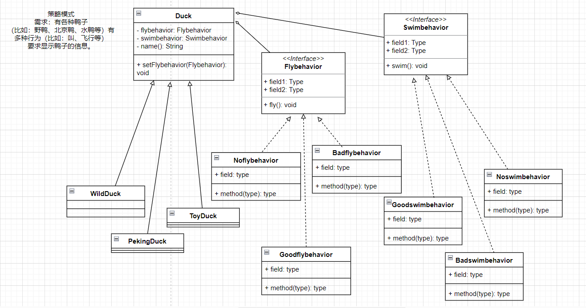
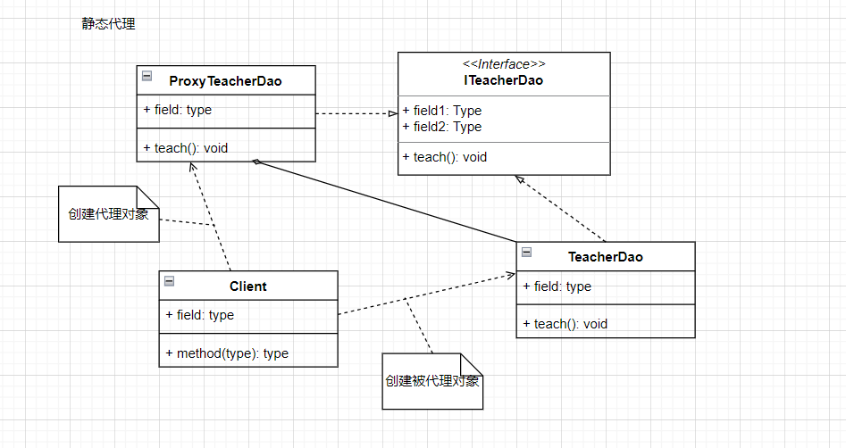

#### 一、软件开发原则
##### 1.单一职责原则（SRP）

> 对于类来说，**一个类应该只负责一项职责**。如果这个类A具有职责1和职责2，当职责1需求发生变化改变类A，可能造成职责2执行错误。
> 目的：降低类的复杂度；提高类的可读性和可维护性；降低变更引起的风险；
> 只有在逻辑足够简单，才可以在代码级违反单一职责原则；只有类中的方法足够少，可以在方法级别保持单一职责原则。
> 否则**应当严格遵循单一职责原则**。

##### 2.开闭原则（OCP）

> 一个软件实体（类、模块、函数）应该对扩展（需求提供方）开放，对修改（功能使用方）关闭。
> 当软件需要变化，尽量通过扩展软件实体的行为来实现变化，而不是通过修改已有的代码来实现变化。

##### 3.依赖倒置原则（DIP）

##### 4、接口隔离原则（ISP）

##### 5.里氏替换原则（LSP）

#### 二、主流的设计模式

##### 1、简单工厂模式（静态工厂模式）
> 专门用来定义一个类负责创建对象，实现对象创建和对象使用分离。解决对象创建的耦合度。
> 设计方案：定义一个可以实例化的对象类，封装对象的代码。

**简单工厂模式实现的UML类图** 

##### 2、策略模式
> 定义了算法家族，分别封装起来，让它们之间互相替换，此模式让算法变化，不会影响到使用算法的客户。
> 策略模式核心思想：是用来封装几乎任何类型的规则，只要在分析过程中听到不同业务时间应用不同的业务规则，
> 就可以考虑采用策略模式来处理这种变化的可能性。
> 策略模式设计原则：把变化代码从不变代码中分离出来；针对接口编程；多用组合/聚合，少用继承
> 策略模式体现了开闭原则，客户端要增加行为，只需要添加一种策略（或行为），避免多重的if ... else语句

**策略模式实现的UML类图** 

##### 3、装饰者模式
> 主要是**动态的将新功能(Features)特性附加到对象上**，在对象功能扩展上面比继承更有弹性，体现OCP原则。
> 用来解决当有很多个类，需要增加新的种类，类的数量会增加，避免出现类爆炸。
> 在增加功能类时，提高了代码可维护性。

**装饰者模式实现的UML类图**

##### 4、代理模式
> 主要是为目标对象提供一个替身，控制这个目标对象的访问。主要目标在目标对象实现的基础上，增强额外的功能操作，达到扩展目标对象的目的。
> 静态代理；主要是在不修改目标对象的功能前提下，通过代理对象对目标对象功能扩展，但是一旦接口增加方法，目标对象和被代理对象都要维护。

**静态代理实现的UML类图**
