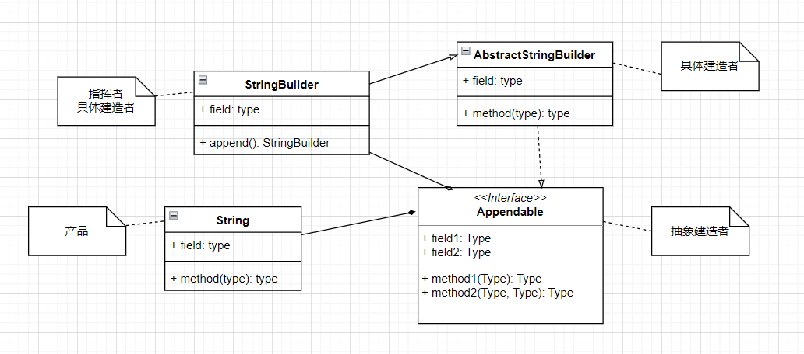

#### 一、软件开发原则
##### 1.单一职责原则（SRP）

> 对于类来说，**一个类应该只负责一项职责**。如果这个类A具有职责1和职责2，当职责1需求发生变化改变类A，可能造成职责2执行错误。
> 目的：降低类的复杂度；提高类的可读性和可维护性；降低变更引起的风险；
> 只有在逻辑足够简单，才可以在代码级违反单一职责原则；只有类中的方法足够少，可以在方法级别保持单一职责原则。
> 否则**应当严格遵循单一职责原则**。

##### 2.开闭原则（OCP）

> 一个软件实体（类、模块、函数）应该对扩展（需求提供方）开放，对修改（功能使用方）关闭。
> 当软件需要变化，尽量通过扩展软件实体的行为来实现变化，而不是通过修改已有的代码来实现变化。

##### 3.依赖倒置原则（DIP）

> 高层模块不应该依赖于低层模块，二者依赖于抽象。
> 抽象不依赖于细节，细节（具体的实现类）依赖于抽象。它的核心是面向接口编程思想
> 依赖传递方式：通过接口传递、构造器传递、Setter方法传递

##### 4、接口隔离原则（ISP）

> 客户端不应该依赖它不需要的接口，就是一个类对另一个类的依赖建立在最小接口上。
> 对于类实现接口对接口拆分成为最小接口原则。

##### 5.里氏替换原则（LSP）

> 所有引用基类的方法必须透明的使用其子类的对象。

##### 6、迪米特法则（最少知道原则）

> 一个类对自己依赖的类知道的越少越好。陌生的类不要以局部变量出现在类的内部。
> 对于被依赖的类不管多么复杂，尽量将逻辑封装在类的内部。
> 迪米特法则只与直接的朋友通信。
> 降低类之间的耦合，并不是要求完全没有依赖关系。

##### 7、合成复用原则(CARP)

> 合成或聚合的方式

#### 二、主流的设计模式

##### 1、简单工厂模式（静态工厂模式）(Simple Factory Pattern)
> 专门用来定义一个类负责创建对象，实现**对象创建和对象使用分离**。解决对象创建的耦合度。
> 设计方案：定义一个可以实例化的对象类，封装对象的代码。

**简单工厂模式需求UML类图** 

##### 2、策略模式(Strategy Pattern)

> 定义了算法家族，分别封装起来，让它们之间互相替换，此模式让算法变化，不会影响到使用算法的客户。
> 策略模式核心思想：是用来封装几乎任何类型的规则，只要在分析过程中听到**不同业务时间应用不同的业务规则**，就可以考虑采用策略模式来处理这种变化的可能性。
> 策略模式设计原则：把变化代码从不变代码中分离出来；针对接口编程；多用组合/聚合，少用继承
> 策略模式体现了开闭原则，客户端要增加行为，只需要添加一种策略（或行为），避免多重的if ... else语句

**策略模式需求UML类图** 

eg: 电商优惠促销策略模式

> 

企业微信消息格式

##### 3、装饰者模式(Decorator Pattern)

> 主要是**动态的将新功能(Features)特性附加到对象上**，在对象功能扩展上面比继承更有弹性，体现OCP原则。
> 用来解决当有很多个类，需要增加新的种类，类的数量会增加，避免出现类爆炸。
> 在增加功能类时，提高了代码可维护性。

**装饰者模式需求UML类图**

> 记录问题：maven工程测试main方法中文乱码：maven -> Runner -> 配置参数 -Dfile.encoding=GBK

eg: 多级缓存架构装饰者模式

> 

参考：springboot项目中应用装饰者：https://juejin.cn/post/6990933352370929672#heading-3

视频播放功能加上特效功能类图

##### 4、代理模式(Proxy Pattern)

> 主要是为目标对象提供一个替身，控制这个目标对象的访问。主要目标在目标对象实现的基础上，增强额外的功能操作，达到扩展目标对象的目的。
> 静态代理；主要是在不修改目标对象的功能前提下，通过代理对象对目标对象功能扩展，但是一旦接口增加方法，目标对象和被代理对象都要维护。

**静态代理需求类图**

> 如果目标对象接口需要增加方法，同时维护目标对象实现类和代理对象。
> 这种方式是满足代理对象对目标对象的功能方法扩展，体现了OCP原则。

**JDK动态代理需求UML类图**

cglib代理
> 目标对象只是单独一个的对象，并没有实现任何接口，使用目标对象子类来实现代理，这是cglib代理。
> cglib可以在运行期扩展java类和实现java接口。在SpringAOP中实现方法拦截。
> 在AOP中选择代理模式：目标对象实现接口选择JDK代理；目标对象不需要实现接口选择cglib代理。

**cglib代理需求UML类图**

eg: AOP底层代理模式

> 

##### 5、工厂方法模式(Factory Method Pattern)
> 定义一个创建对象的抽象方法，由子类决定要实例化的类。将对象的实例化推迟到子类上。

**工厂方法模式需求UML类图**

##### 6、原型模式(Prototype Pattern)

> 原型模式是指用原型实例指定创建对象的种类，并且通过拷贝这些原型，创建新的对象。通过将一个原型对象传给那个要发动创建的对象，
> 这个要发动创建的对象通过请求原型对象拷贝它们自己来实施创建。object.clone()
> 创建新的对象比较复杂，可以利用原型模式简化对象创建过程。动态地获得对象运行时的状态。

**原型模式需求UML类图**

**两个概念**

> 浅拷贝: 对于数据类型是基本类型的成员变量，浅拷贝直接进行值传递。将对象属性值复制到新的对象中。对于数据类型是引用类型的成员变量进行引用传递，
> 就是将成员变量的引用值复制到新的对象。
> 深拷贝：复制对象的所有基本数据类型的成员变量值，为所有引用数据类型的成员变量申请存储空间并复制引用对象。

##### 7、模板方法模式(Template Method Pattern)

> 在一个抽象类(AbstractClass)中公开定义了执行它的方法模板，它的子类可以按需要的重写方法实现，调用以抽象类中定义的方式进行。
> (ConcreteClass)定义了一个操作中的算法的骨架，将一些步骤延迟到子类中，使子类不改变算法结构就可以重定义该算法的某些**特定步骤**。
> 模板方法的钩子方法：在模板方法的父类中，定义一个方法，默认不做任何事，子类可以视情况要不要覆盖。

**模板方法模式需求UML类图**

eg: RedisTemplate、JDBCTemplate模板方法模式

> 

**IoC源码应用模板方法模式**

> 基本思想：算法只存在一个地方(父类中)，易于修改。实现代码最大化的代码复用。父类的模板方法和已实现的某些步骤被子类继承而直接使用。
> 一般模板方法加上final关键字，防止子类重写模板方法。
> 适用场景：当要完成在某个过程，该过程执行一系列步骤，这一系列步骤步骤基本相同，但个别步骤在实现有所不同，考虑使用模板方法模式。

##### 8、外观模式(Facade Pattern)

##### 9、建造者模式(Builder Pattern)

> 对象构建模式，可以将复杂的对象建造过程抽象出来（抽象类别），使这个抽象过程的不同实现方式可以构造出不同的表现（属性）的对象。
> 通过一步一步创建一个复杂对象，允许用户只通过指定复杂对象的类型和内容就可以构建，用户不需要知道内部的具体细节。
> 构成：Product(产品)、Builder(抽象建造者)、ConcreteBuilder(具体建造者)、Director(指挥者)

**建造者模式需求UML类图**

**StringBuilder源码应用建造者模式**

##### 10、观察者模式(Observer Pattern)

> 观察者模式（发布/订阅模式）通过Subject被依赖对象和Observer依赖对象形成了一对多的关系；
> Subject对象有注册用户方法、移除用户方法、通知用户方法，一旦Subject对象有变化就会
> 通知调用Observer对象的update方法就会更新。

**观察者模式需求UML类图**

eg: Zookeeper监听器观察者模式

> 

**jdk应用Observale源码类图**

##### 11、抽象工厂模式(Abstract Factory Pattern)

**抽象工厂模式需求UML类图**

> 在设计层面抽象工厂接口和具体实现的工厂子类，让单个简单工厂变成工厂簇
> 便于代码扩展和维护。根据创建对象类型对应工厂子类。

##### 12、状态模式(State Pattern)

##### 13、适配器模式(Adapter Pattern)

> 一个类的接口可以转换成所期望的另一类的接口，它的目的是让接口达到兼容性。
> 适配器模式为了解决接口不匹配问题。分别有类、对象、接口适配器，
> 在用户角度看不到被适配者，从用户反馈感觉只和目标接口交互。

**类适配器需求UML类图**

**对象适配器需求UML类图**

> 解决了用组合替代继承，符合了合成复用的原则。

**接口适配器需求UML类图**

> 当某个类不需要实现全部接口方法，抽象类的子类可以选择的覆盖父类的某些方法。
> 程序中匿名内部类可以抽象类的实现类

##### 14、备忘录模式(Memento Pattern)

##### 15、组合模式(Composite Pattern)

> 用来表示整体和部分的关系，创建了对象组的树形结构，将对象组合成树状结构。让客户以一致的方式处理个别对象及组合对象。
> 角色分析：
> Component: 组合对象的声明接口，实现所有类共有的接口默认行为（抽象类或接口）
> Leaf: 叶子节点，对象不可划分了
> Composite: 非叶子节点，存储子部件，实现子部件

**组合模式需求UML类图**

**HashMap应用源码类图**

##### 16、迭代器模式(Iterator Pattern)

> 提供了一种遍历集合元素的统一接口，用一致的方法遍历集合元素，不需要知道集合对象元素的底层表示。即：不暴露集合元素的内部结构。
> 角色分析：
>     1、迭代器接口 (Iterator)
>     2、具体实现迭代器的子类
>     3、统一的聚合接口，返回迭代器对象
>     4、实现聚合接口的子类

**迭代器需求UML类图**

**ArrayList集合应用源码类图**

##### 17、单例模式(Singleton Pattern)

> 在系统中某个类只能存在一个对象实例。
> 1.饿汉式（静态常量）：在类加载的时候完成实例化，避免了线程同步问题。但是没有达到Lazy Loading效果，会造成内存浪费。
> 基于ClassLoader机制避免多线程的同步问题，instance在类加载时实例化调用getInstance()方法。√
> 2.饿汉式（静态代码块）：在类装载时，执行静态代码块中的代码，初始化类的实例。可能造成内存浪费。
> 3.懒汉式（线程不安全）：起到Lazy Loading，在并发环境下多个线程可能产生多个实例。
> 4.懒汉式（线程安全 同步方法）在并发环境下每一个线程在获得类的实例时，都要执行getInstance()方法进行同步锁。
> 5.懒汉式（线程安全 同步代码块）并发环境下，也会产生多个实例。
> 6.双重检查：并发环境下，实例化代码只执行一次，之后创建实例化对象直接返回实例化对象。线程安全，延迟加载 √
> 7.静态内部类：采用类加载机制保证初始化实例只有一个线程。类的静态属性只会在第一次加载类的时候初始化，jvm保证了线程的安全性。√
> 8.枚举方式：防止反序列化创建新的对象。√

eg: 线程池单例模式

> 

##### 18、桥接模式(Bridge Pattern)

> 将实现与抽象放在两个不同的类层次中，使两个层次可以独立改变。桥接模式基于类的最小设计设计模式。通过使用封装、聚合及继承等行为让不同类承担不同的职责。
> 将抽象和行为实现分离开，从保持各部分的独立性及应对他们功能扩展。

**桥接模式需求UML类图**

##### 19、命令模式(Command Pattern)

##### 20、职责链模式(Chain of Responsibility Pattern)

> 职责链模式是为发送者请求创建一个接收者对象的链路；这种模式实现了请求的发送者和接收者的解耦效果。
> 每一个接收者包含对另一个接收者的引用。

**职责链模式需求UML类图**

eg: 微服务网关鉴权责任链模式

> 

**实际项目中采购业务根据业务流程图完成类图及编码**

##### 21、中介者模式(Mediator Pattern)

##### 22、享元模式(Flyweight Pattern)

##### 23、解释器模式(Interpreter Pattern)

##### 24、访问者模式(Visitor Pattern)

